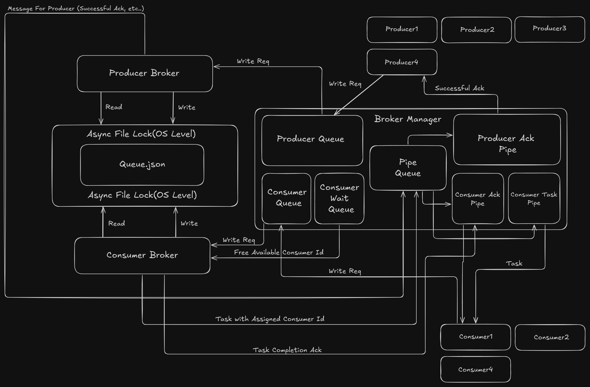

# Distributed Queue

A lightweight, file-based distributed queue system implemented in Python. This project demonstrates various distributed queue implementations, starting with a simple JSON-based persistence model.

## 🚧 Status: Work in Progress

- **Single JSON Queue**: Full Publisher-Consumer loop implemented.
    - Publishers write tasks with ACK.
    - Consumers register, receive tasks, process them, and update status.
    - Broker splits logic into separate Writer (Publisher) and Reader (Consumer) processes.
- **Other Implementations**: Planned.

## Implementations

### 1. Single JSON Distributed Queue (`src/singleJsonDistributedQueue`)

This implementation uses a local JSON file as the persistent queue storage, managed by a dedicated broker process.

#### Key Features

- **File-Based Persistence**: Uses `Queue.json` as the single source of truth.
- **Dual-Broker Architecture**:
    - **PublisherBroker**: Dedicated process for handling high-throughput write operations. Batch writes every 2 seconds.
    - **ConsumerBroker**: Dedicated process for task lifecycle management. Actively scans `Queue.json` for unassigned tasks and assigns them to idle consumers. Removes completed tasks from storage.
- **Process Isolation**: Brokers run in separate `multiprocessing.Process` instances to decouple file I/O and logic from the main application.
- **Event-Driven Architecture**: Communication uses strict `Event` objects passed through `multiprocessing.Queue`.
- **Consumer Lifecycle Management**:
    - Consumers explicitly register with the Broker.
    - Idle consumers are tracked in a `WaitingQueue`.
    - Tasks are pushed to consumers via dedicated `Pipe` connections (Push model).
- **Reliable Acknowledgements**: Both Publishers and Consumers receive explicit acknowledgements for their operations.
- **Concurrency Control**: Uses `filelock` to ensure safe access to the JSON file across multiple processes.
- **High Performance Serialization**: Utilizes `msgspec` for ultra-fast JSON encoding/decoding, replacing standard libraries.

#### Architecture



The system consists of three main components:

1.  **Publisher (`Publisher.py`)**:
    -   Generates a `TaskIn` object containing data.
    -   Sends a `WRITE` event to the `PublisherBroker`.
    -   Waits for synchronous acknowledgement via a dedicated pipe connection.

2.  **Consumer (`Consumer.py`)**:
    -   Registers with the `BrokerManager` to receive a dedicated Task Pipe.
    -   Enters a wait loop listening for assigned tasks.
    -   Processes tasks (simulates work) and sends updates back to the system.
    -   Automatically re-queues itself as "Available" after task completion.

3.  **Broker Manager (`BrokerManager.py`)**:
    -   **Orchestrator**: Manages the lifecycle of `PublisherBroker` and `ConsumerBroker` processes.
    -   **Registry**: Maintains maps of all active Publishers (`publisherMap`), Consumers (`consumerMap`), and Task Assignment connections (`consumerTaskMap`).
    -   **Router**: Listens for completion events and routes acknowledgements/tasks to the correct specific process via Pipes.
    -   **Queue Hub**: Acts as the central hub for multiple `multiprocessing.Queue` instances (`publisherBrokerQueue`, `consumerBrokerQueue`, `acknowledgementQueue`, `consumerWaitingQueue`, `consumerTaskMapQueue`).

4.  **Broker Processes**:
    -   **PublisherBroker**: Handles `TaskIn` write requests. Batches operations to `Queue.json` (flushing every 2s).
    -   **ConsumerBroker**: Handles `Task` updates. 
        -   **Scanning**: Actively scans `Queue.json` every 2s for unassigned tasks.
        -   **Assignment**: Retrieves idle consumers from `consumerWaitingQueue` and dispatches tasks.
        -   **Completion**: Removes completed tasks from `Queue.json`.

#### Data Models

-   **`Event`**: The envelope for communication. Contains `EventType`, `EventOwner`, and payload.
-   **`TaskIn`**: DTO sent by Publishers.
-   **`Task`**: Full task object stored in `Queue.json` and processed by Consumers.

## Dependencies

-   Python >= 3.14
-   `aiofiles`: Asynchronous file I/O.
-   `filelock`: Platform-independent file locking.
-   `msgspec`: Fast JSON serialization/deserialization and validation.
-   `uv`: (Mandatory) For project management and running.

## Setup

This project relies on `uv` for dependency management and execution.

1.  **Sync Dependencies**:
    ```bash
    uv sync
    ```

2.  **Run the Application**:
    Run the module directly using `uv run`. This command handles the environment activation automatically.
    ```bash
    uv run python -m singleJsonDistributedQueue.main
    ```

## Project Structure

```text
src/singleJsonDistributedQueue/
├── broker/          
│   ├── BrokerManager.py     # Orchestrator, connection registry, routing logic
│   ├── PublisherBroker.py   # Handling Writes & Batching
│   └── ConsumerBroker.py    # Handling Task Assignment & Reads
├── enum/            
│   ├── EventOwner.py        # Enums for system components
│   └── EventType.py         # WRITE, READ, SHUTDOWN
├── model/           
│   ├── Event.py             # Communication envelope
│   └── Task.py              # data models
├── queue/           
│   └── Queue.json           # Data storage
├── Publisher.py     # Client interface for writing tasks
├── Consumer.py      # Client interface for processing tasks
└── main.py          # Demonstration entry point
```
